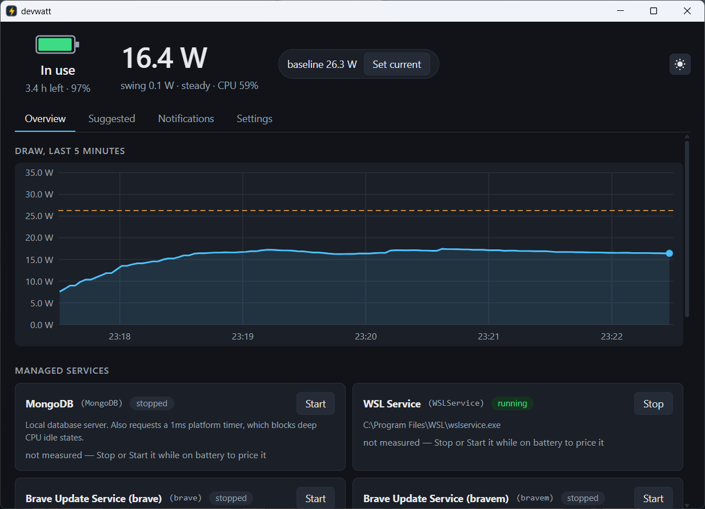
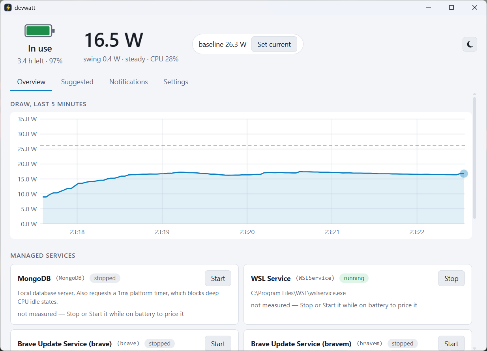
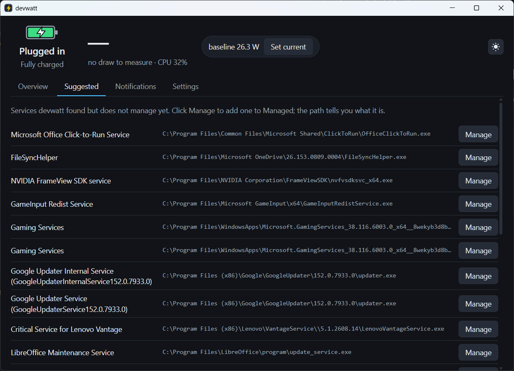
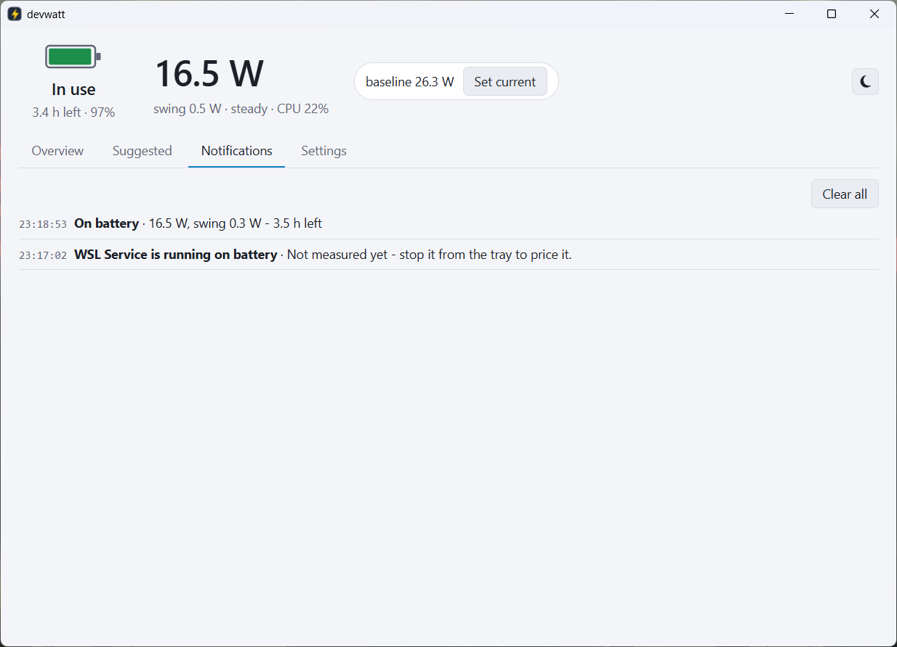
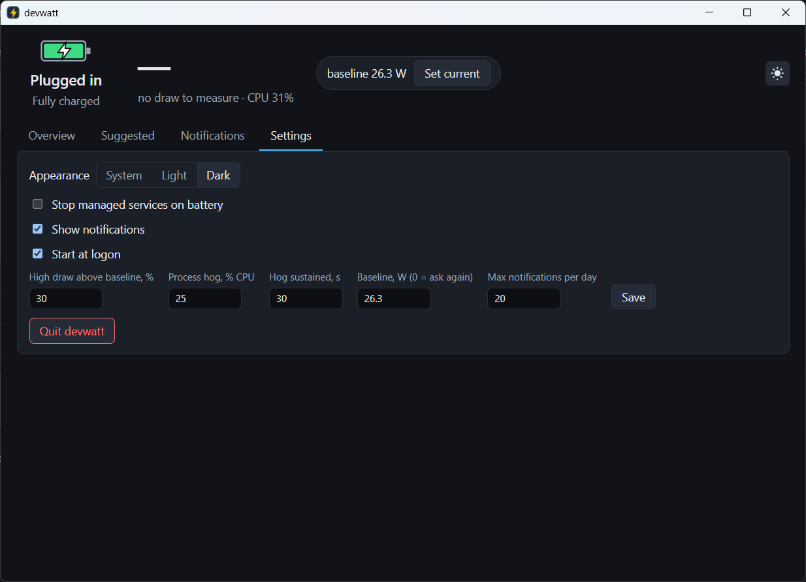

# devwatt

**Know what your laptop is really drawing on battery, and what each developer service costs — measured, not guessed.**

devwatt is a Windows tray application for developers. It reads real watts from the battery controller, lets you stop the local services you are not using (PostgreSQL, MongoDB, Docker Desktop, Redis, …) with one click, and shows the saving as a measured number with the caveats attached. It can do that automatically when you unplug, tell you when something is burning power, and put it all on a live dashboard.



## Why

Task Manager's "Power usage" column is a qualitative model. The battery controller reports the actual discharge rate in milliwatts, and everything devwatt says starts from that number:

- **Measure first.** Eight readings, 1.2 s apart, averaged. The *swing* between them is reported next to the average, and a wide swing means the number is not trusted.
- **Attribute second.** Per-process CPU time says who is busy; the top programs are named when draw is high.
- **Prove with A/B.** Stopping a service is measured as *before → change → settle → after*. If the readings were unstable on either side, or CPU load moved by more than 5 points between them, the result is reported as **void**, not as a saving. A number devwatt cannot stand behind is never shown as one.

## What it does

| | |
|---|---|
| **Live draw** | Watts, swing, estimated runtime and CPU load in the tray tooltip, the menu, and the dashboard header. |
| **Managed services** | A curated allowlist of developer services devwatt is willing to control, plus anything you choose from the *Suggested* list. A hard denylist (security software, VPNs, disk encryption, core OS) that no setting or config edit can override. |
| **Priced toggles** | Every Stop/Start on battery is an A/B measurement. Cards remember the last measured cost of each service. |
| **On-battery policy** | Optional: stop every running managed service when the charger comes out, and start exactly those again when it comes back. |
| **Notifications** | On-battery summary, high draw above *your* baseline (naming the top CPU users), a program hogging the CPU for 30 s, a managed service left running on battery, and a nudge to set a baseline. A switch, a per-day cap, and a log that keeps everything. |
| **Dashboard** | Continuously scrolling 5-minute chart, service cards, suggested services with their binary paths, notification log, settings. Light, dark, or system theme. |
| **Fits in** | Searchable from the Start menu, one instance only, starts at logon, sharp on high-DPI displays, and **no UAC prompt after install** — the UI runs as you; a small elevated helper does the two calls that need it. |

## Screenshots

| Overview, light theme | Suggested services |
|---|---|
|  |  |

| Notifications | Settings |
|---|---|
|  |  |

## Install

Download `devwatt-setup-<version>.exe` from the [Releases](../../releases) page and run it. The installer:

- copies `devwatt-tray.exe` and `devwatt.exe` to `C:\Program Files\devwatt` and registers devwatt in *Settings › Apps*;
- registers two scheduled tasks: `devwatt` (the tray, at logon, as you) and `devwatt-helper` (the elevated helper, at logon and on demand, with highest privileges — this is what makes every later launch prompt-free);
- adds **devwatt** to the Start menu, so the dashboard is a search away.

The installer is not code-signed, so SmartScreen will show an "unknown publisher" warning on first run.

Uninstall from *Settings › Apps* (or `uninstall.exe` in the install folder). Your settings in `%APPDATA%\devwatt\config.json` are kept; the WebView2 cache is removed.

### Requirements

- Windows 10 1809 or later, or Windows 11, 64-bit. A laptop with a battery for anything power-related; on a desktop the service controls still work.
- An account that can elevate once, for the install.
- The [WebView2 runtime](https://developer.microsoft.com/microsoft-edge/webview2/) for the dashboard (present on Windows 11 and almost every Windows 10 machine). The tray, toasts and policy work without it.

## Using it

**Set a baseline.** The first time you are on battery and the machine is idle, open the dashboard and click **Set current** (devwatt reminds you once per battery session). The baseline is never set automatically — a number picked while something was busy would silence the high-draw alert for good. You can change it any time in *Settings*.

**Price a service.** On battery, click **Stop** (or **Start**) on a managed service. About 30 s later the card shows what changed:

```
postgresql-x64-17 stopped: -1,100 mW (21,800 -> 20,700 mW, CPU 30->29%)
postgresql-x64-17 stopped: VOID - CPU moved 31->39%
```

A void result is a fact, not a failure: something else changed at the same time, so the comparison is not usable. Run it again when the machine is quieter.

**Manage more.** The *Suggested* tab lists services devwatt found but does not manage yet, with the binary path so you can tell what each one is. **Manage** adds one to the managed set; **Remove** takes it out.

**Let it act for you.** Tick *Stop managed services on battery* (tray menu or *Settings*). Stops caused by the policy are plain stops — the AC transition is itself a confounder, so they are not priced.

**Notifications** can be switched off in the tray menu or *Settings*, and are capped per day (20 by default). Everything still lands in the dashboard's log, marked "logged only" when it was not shown.

## The command line

`devwatt.exe` exposes the same measuring and service control from a terminal, where the numbers are visible:

```
devwatt                            list managed and suggested services
devwatt measure                    sample the battery and report sustained draw
devwatt cost <service> stop|start  stop or start a service and report what it changed
devwatt install                    register the logon tasks and the Start menu entry
devwatt uninstall                  remove them
```

`list` and `measure` work from any terminal; the other three need an elevated one and say so.

```
> devwatt measure
Battery  82%  47420 of 57860 mWh, discharging
Sampling 8 readings 1.2s apart...
  readings  21691 21691 21871 21871 21871 21871 21767 21767 mW
  AVG       21800 mW
  SWING     180 mW  (min 21691, max 21871)  steady
  CPU       29.9% busy over the window
  RUNTIME   2.17 h at this draw  (47370 mWh remaining)
```

## How it is built

devwatt is two processes from one binary:

- **`devwatt-tray.exe`** runs as you, unelevated: tray icon, dashboard (WebView2), every measurement, discovery, notifications, the policy. An elevated window would block every medium-integrity keyboard, clipboard and accessibility tool from interacting with it (Windows UIPI), so the UI never runs elevated — an elevated launch hands itself over to the `devwatt` task.
- **`devwatt-tray.exe --helper`** runs elevated and windowless, started by the `devwatt-helper` task. It serves one named pipe, `\\.\pipe\devwatt-control`, whose ACL admits SYSTEM, Administrators and the installing user only. Protocol: one line per connection — `stop <name>` or `start <name>` — answered with `ok` or `error <text>`. The denylist is enforced *under* the pipe, in the same package the CLI uses, so the UI is not the only gate.

Any process running as you can therefore stop or start an *allowlisted* service without a prompt. That is the same trust the logon task already grants; nothing beyond the allowlist is reachable.

Other decisions worth knowing:

- Battery draw comes from `CallNtPowerInformation(SystemBatteryState)` — the same ACPI data WMI's `BatteryStatus` exposes, read directly, with no COM or WMI dependency. A reading counts as a discharge only when unplugged *and* the rate is negative, so the zero the controller reports at the instant you plug in never enters a chart, a window or a measurement.
- "Time left" is projected from the last five minutes of readings, not the last twenty seconds: runtime is a long-horizon quantity, and a twenty-second window jumps with every burst and disagrees with the dampened estimate Windows shows. The CLI's `RUNTIME` line is the short-window projection and says so — "at this draw".
- The chart is a persistent SVG driven by `requestAnimationFrame`: time scrolls continuously, the scale eases, and the line is straight segments between real readings — nothing is interpolated.
- Notifications ride the tray icon's own balloon (`Shell_NotifyIcon`), which Windows 10/11 render as toasts, so there is no COM activation or AppUserModelID to register.
- All console output is plain ASCII, because PowerShell 5.1 pipes mangle anything else.

### Packages

| Package | Role |
|---|---|
| `internal/battery` | Battery controller reads; sampled measurements with average, swing and runtime; the rolling window. |
| `internal/cpuload`, `internal/procload` | Whole-machine CPU load (the confounder) and per-process attribution. |
| `internal/cost` | The A/B protocol: measure, act, settle, measure; the void rule. |
| `internal/catalog`, `internal/discover` | The allowlist and denylist; finding plausible developer services on a machine. |
| `internal/control`, `internal/scm`, `internal/helper`, `internal/elevate` | Stopping and starting services with the least rights; the elevated helper and its pipe. |
| `internal/alert`, `internal/notify` | The notification rules (pure) and the tray-icon toast. |
| `internal/config`, `internal/autostart`, `internal/shortcut`, `internal/icon`, `internal/traywin` | Settings, the two logon tasks, the Start-menu entry, the icon, finding the tray's window. |
| `cmd/devwatt` | The command line. |
| `cmd/devwatt-tray` | The tray, the dashboard (`dashboard.html`), the helper mode, single-instance hand-off. |
| `installer/` | The NSIS script and the build script. |

## Configuration

`%APPDATA%\devwatt\config.json`, written by the app; a missing file means defaults.

| Key | Default | Meaning |
|---|---|---|
| `adopted` | `[]` | Services you chose to manage from the Suggested list. Denied names are rejected on load. |
| `stop_on_battery` | `false` | The on-battery policy. |
| `baseline_mw` | `0` | Your idle draw; `0` means "ask me once per battery session". |
| `high_draw_percent` | `30` | Alert when draw is this far above the baseline. |
| `hog_cpu_percent`, `hog_sustain_seconds` | `25`, `30` | A program holding this share of the CPU for this long is named. |
| `notifications`, `max_toasts_per_day` | `true`, `20` | The switch and the daily cap. |
| `theme` | `"system"` | `system`, `light` or `dark`. |
| `costs` | `{}` | The last measured cost of each service, as shown on its card. |

## Build from source

Go 1.26 and, for the installer, [NSIS](https://nsis.sourceforge.io/).

```powershell
go build ./...                                   # everything compiles
go build -o bin\devwatt.exe ./cmd/devwatt
go build -ldflags "-H=windowsgui" -o bin\devwatt-tray.exe ./cmd/devwatt-tray
powershell -ExecutionPolicy Bypass -File installer\build.ps1 -Version 1.0.0   # both binaries + dist\devwatt-setup-1.0.0.exe
```

There is no test suite by design: everything here depends on real hardware, real Windows services and a real desktop, and the project is verified by running it on them. `go vet` and `staticcheck` are clean, and every exported identifier has a caller.

## Limitations

- Windows only, by nature.
- Per-process CPU attribution excludes protected processes that refuse to be opened; their time is still in the machine total.
- The measured cost of a service is the cost on *this* machine under *these* conditions; the void rule catches the obvious confounders, not all of them.
- Per-item tooltips in the tray menu are not rendered by the tray library on Windows, so the safety notes for each service live in `devwatt list` and on the dashboard cards.
